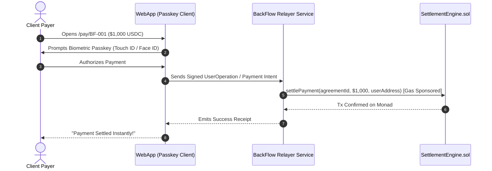

# BackFlow — Complete System Architecture Specification

## 1. High-Level Topology

```mermaid
flowchart TD
    subgraph ClientLayer ["Client / Consumer Layer"]
        Payer["Client / Payer"]
        EarnerUser["Earner (Freelancer/Creator)"]
        BackerUser["Backer Syndicate"]
    end

    subgraph FrontendApp ["Next.js 15 Web Application"]
        PayPage["Pay Page (/pay/[agreementId])"]
        Dashboard["Earner Dashboard (/dashboard)"]
        SimPage["Settlement Simulator (/simulator)"]
        PasskeyModule["Passkey / Embedded Wallet Adapter"]
    end

    subgraph BackendLayer ["Node.js API & Indexer"]
        API["Express / Fastify REST API"]
        PaymentAdapter["Testnet / Crypto Payment Adapter"]
        Indexer["Idempotent Blockchain Listener"]
    end

    subgraph DatabaseLayer ["PostgreSQL / Supabase"]
        DB[(Users, Agreements, Backers, Settlements, Invoices)]
    end

    subgraph MonadLayer ["Monad Testnet EVM Blockchain"]
        AgreementMgr["AgreementManager.sol"]
        SettlementEng["SettlementEngine.sol"]
        MockToken["USDC / Payment Asset"]
    end

    Payer -->|1-Click Pay| PayPage
    EarnerUser -->|Manage & Invoicing| Dashboard
    BackerUser -->|Simulate & Fund| SimPage

    PayPage --> PasskeyModule
    PasskeyModule -->|Sponsored Tx / Direct| SettlementEng
    
    SettlementEng -->|Query Terms & Caps| AgreementMgr
    SettlementEng -->|Transfer Token Shares| MockToken
    MockToken -->|Pro-rata Cut| BackerUser
    MockToken -->|Net Revenue| EarnerUser

    SettlementEng -.->|Emit PaymentSettled Event| Indexer
    AgreementMgr -.->|Emit Agreement/Backer Events| Indexer
    Indexer -->|Idempotent Upsert (tx:log)| DB
    API -->|Read-only Queries| DB
    Dashboard -->|Fetch Live Cache| API
```

---

## 2. On-Chain Settlement Pipeline

When a payer executes a payment of $P_{\text{gross}}$:

1. **Token Ingestion**:
   `SettlementEngine.sol` executes `IERC20(paymentToken).safeTransferFrom(payer, address(this), grossAmount)`.
2. **Rate Calculation**:
   $$\text{rawBackerCut} = \frac{P_{\text{gross}} \times \text{revenueShareBps}}{10000}$$
3. **Loop & Clamp**:
   For each backer $i$:
   - Calculate theoretical pro-rata:
     $$\text{share}_i = \frac{\text{rawBackerCut} \times \text{fundedAmount}_i}{\text{totalFunded}}$$
   - Calculate remaining cap:
     $$\text{remCap}_i = \text{maxCap}_i - \text{distributedAmount}_i$$
   - Actual payout:
     $$A_i = \min(\text{share}_i, \text{remCap}_i)$$
   - Execute `safeTransfer(backer_i, A_i)`.
   - Update `AgreementManager` state.
4. **Earner Waterfall**:
   $$P_{\text{earner}} = P_{\text{gross}} - \sum A_i$$
   Execute `safeTransfer(earner, P_{\text{earner}})`.
5. **Auto-Termination**:
   If all active backers satisfy $\text{distributedAmount}_i \ge \text{maxCap}_i$, agreement transitions to `COMPLETED`.

---

## 3. Account Abstraction & Passkey Architecture



---

## 4. Disaster Recovery & Fallback Strategies

- **RPC Failure**: Secondary RPC fallback configured via Viem transport failover.
- **Indexer Gap Recovery**: On indexer restart, the worker queries `eth_getLogs` from `last_processed_block` up to `latest_block`.
- **Emergency Circuit Breaker**: The Earner or Protocol Owner can trigger `pauseAgreement()` to halt settlement in case of compromised client keys or disputable invoices.
