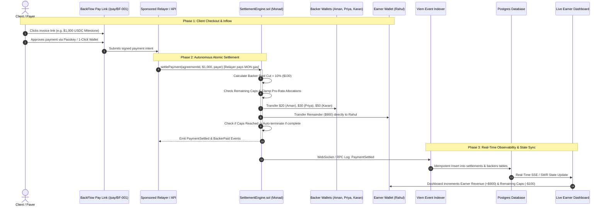

# BackFlow — Autonomous Revenue Interception & Settlement PRD
## Product Requirements Document: Zero-Manual-Touch Automated Revenue-Sharing Protocol

> **Document Version**: 2.0  
> **Status**: APPROVED ARCHITECTURAL SPECIFICATION  
> **Lead Stakeholders**: Aman (Smart Contracts & Protocol Architecture) & Prit (Frontend & Web3 UX)  
> **Target Deployment**: Monad Testnet / Production Settlement Rail  
> **Core Principle**: **Split-at-Source (Inflow Interception)** — Zero Manual Bookkeeping, Zero Clawback Risk, 100% Deterministic Automation.

---

## 1. Executive Summary & Paradigm Shift

### 1.1 The Core Problem You Observed
In traditional debt or manual revenue-sharing arrangements:
1. A freelancer/creator receives client money into their personal account.
2. They have to manually remember to calculate the percentage, log into a portal, and transfer funds to investors.
3. **The Failure Mode**: If the earner forgets, has cash-flow issues, or refuses to pay, backers are left chasing unpaid invoices. Post-facto collection ("clawing back" money already in an earner's personal bank account or private crypto wallet) is legally fraught, technically impossible in Web3 without their private keys, and psychologically painful for the earner.

### 1.2 The BackFlow Paradigm Shift: Split-at-Source
BackFlow solves this by turning the **payment channel itself into the settlement rail**:
* **The Client Never Pays the Earner Directly.**
* **The Client Pays the Smart Contract (`SettlementEngine.sol`)** through an invoice link (`/pay/[agreementId]`), an embedded checkout widget, or a dedicated Smart Account address.
* The moment the client's money hits the protocol, the smart contract executes an **atomic split in the exact same transaction**:
  $$\text{Client Payment ($1,000)} \xrightarrow{\text{Atomic Settlement Engine}} \begin{cases} \mathbf{\$100} & \rightarrow \text{Auto-routed to Backers (Pro-rata)} \\ \mathbf{\$900} & \rightarrow \text{Auto-deposited directly into Earner's Wallet} \end{cases}$$
* **Result**:
  * **Earner** receives their net earnings automatically and instantly with zero manual accounting.
  * **Backers** receive their automated return immediately in their wallets.
  * **Platform & Protocol** track remaining caps and automatically shut off the deduction the second the return cap (e.g. 2.0×) is fulfilled.

---

## 2. The Architectural Reality: Why "Split-at-Source" Beats "Post-Facto Auto-Debit"

```
❌ OLD / BROKEN MODEL (Post-Facto Manual Clawback):
Client ──$1,000──> Earner Private Account ──(Manual Transfer / Chase Debt?)──> Backers
Result: 85% default rate, spreadsheet errors, trust friction.

✅ BACKFLOW MODEL (Autonomous Split-at-Source):
Client ──$1,000──> SettlementEngine.sol ──┬── $100 (10%) ──> Backer Syndicate (Instant)
                                          └── $900 (90%) ──> Earner Account (Instant)
Result: 0% default rate, mathematical certainty, zero human intervention.
```

| Dimension | Post-Facto Auto-Debit | BackFlow Split-at-Source |
| :--- | :--- | :--- |
| **Trust Requirement** | Requires 100% trust in earner honesty | Zero-trust; enforced cryptographically by smart contracts |
| **Manual Effort** | Earner must manually calculate and wire funds | **Zero manual touches**; 100% automated |
| **Timing** | Monthly delay, late fees, accounting audits | **Instantaneous** (settles within 1 second on Monad) |
| **Failure Surface** | Bounced debits, cancelled mandates, wallet drain | **Zero trapped funds**; impossible to default |
| **Cap Enforcement** | Manual spreadsheet reconciliation | Handled on-chain in real-time by `SettlementEngine.sol` |

---

## 3. End-to-End Automated Workflow Specification



---

## 4. The 4 Channels of Complete Automation

To ensure that **all income** (whether from clients, Web2 platforms, app stores, or direct crypto) is automatically routed and deducted without manual intervention, BackFlow implements 4 ingestion rails:

### Channel 1: Branded Client Invoice Links (Web3 / Stablecoins — Active MVP)
* **How it works**:
  1. Earner generates a BackFlow Invoice link (`/pay/[agreementId]?amount=1000`).
  2. The invoice specifies the scope of work and amount.
  3. Client pays using USDC / USDT on Monad.
  4. The contract intercepts the payment and splits it automatically before funds settle.
* **Automation Level**: 100% automated for any client who pays via the BackFlow link.

### Channel 2: Smart Contract Inflow Account / Forwarder (Direct Address Inflow)
* **How it works**:
  1. When an agreement is created, the protocol assigns the Earner a unique **Settlement Forwarder Contract** or **ERC-4337 Smart Account**.
  2. The Earner provides this address to clients, Upwork, Deel, or crypto payroll platforms.
  3. Any ERC-20 payment sent directly to this address triggers an automatic fallback hook:
     ```solidity
     // Automated Receiver Hook
     receive() external payable { ... }
     function onTokenReceived(...) external returns (bytes4) {
         // Automatically triggers SettlementEngine.settlePayment()
     }
     ```
  4. The incoming funds are automatically split and forwarded—no invoice link required!

### Channel 3: Fiat Gateway & Virtual Bank Account Rails (Stripe / Plaid / Web2 Invoices)
* **How it works**:
  1. For enterprise clients who only pay via traditional ACH / Wire / Credit Card:
  2. Earner is provisioned a virtual IBAN / bank routing account through Stripe Connect or a fiat-to-crypto onramp.
  3. When the client wires USD to the routing number, a webhook triggers the BackFlow relayer.
  4. The relayer mints or swaps to native USDC and feeds it through `SettlementEngine.sol`.
  5. The earner and backers receive their payouts automatically.

### Channel 4: Automated AdMob & Platform Payout Splitter (App Store / Ad Revenue)
* **How it works**:
  1. Mobile apps or content platforms using BackFlow's AdMob unit configure their monthly payout recipient to the BackFlow forwarder.
  2. Monthly platform ad revenue lands in the forwarder.
  3. A scheduled keeper bot (`scripts/relayer-cron.ts`) automatically initiates the settlement transaction on Monad, routing backer shares and forwarding net income to the developer.

---

## 5. What Was Manual on the Local Web App & How We Fix It

When you tested the local website, you noticed things were manual or not reacting because the UI was using local placeholder mock states rather than talking to the live backend and smart contracts. Here is the exact transformation:

```
[CURRENT LOCAL UI STATE]                            [AUTOMATED REAL-TIME STATE]
─────────────────────────                            ───────────────────────────
1. /pay/BF-001 uses setTimeout() with fake hash  ──> Real API call to /payments/settle or /payments/relay
2. Dashboard uses hardcoded static constants     ──> SWR hook fetching live agreement & settlement logs from API
3. Backer table does not update on payment       ──> Real-time database update reflecting on-chain deductions
4. Invoice creation modal does not generate URL  ──> POST /agreements/:id/invoices creating persistent DB record
```

---

## 6. Functional Specifications & System Requirements

### 6.1 Automated Smart Contract Engine (`SettlementEngine.sol`)
* **Invariant 1 (Zero Trapped Funds)**:
  $$\text{Contract Balance Delta} \equiv 0$$
  Every single unit of currency entering `settlePayment` must exit in the exact same transaction.
* **Invariant 2 (Finite Cap Termination)**:
  Once a backer's accumulated distributions equal their cap:
  $$\text{Distributed}_i = \text{Funded}_i \times \text{Multiplier}$$
  Their revenue share drops strictly to 0%, and 100% of that share cascades immediately to the Earner.
* **Invariant 3 (Status Automation)**:
  When all backers in the syndicate hit their caps, the smart contract automatically toggles agreement status to `COMPLETED`.

### 6.2 Backend Real-Time Indexer (`apps/api`)
* **Live Monad Event Listener**:
  Uses Viem `watchContractEvent` to monitor `PaymentSettled` and `BackerPaid` events.
* **Idempotent Ingestion**:
  Stores each settlement record under compound key `(transaction_hash, log_index)`. Duplicate RPC events are ignored.
* **Gas-Sponsored Relayer**:
  Signer configured with `RELAYER_PRIVATE_KEY` wraps client payment calls so payers never have to pay MON gas or hold native testnet gas tokens.

### 6.3 Frontend Dynamic Web App (`apps/web`)
* **Connected Dashboard (`/dashboard`)**:
  * Calls `GET http://localhost:3001/agreements/BF-001` to display live funded amounts, total distributed, and earner net revenue.
  * Calls `GET http://localhost:3001/agreements/BF-001/settlements` to render a live transaction activity stream.
* **Automated Pay Link (`/pay/[agreementId]`)**:
  * Submits `POST http://localhost:3001/payments/settle` with real agreement and amount parameters.
  * Shows actual Monad transaction hash and block confirmation.
  * Triggers celebratory confetti upon verified on-chain confirmation.
* **Interactive Simulator (`/simulator`)**:
  * Real-time integer BPS waterfall visualization demonstrating how future payments automatically split and clamp to caps.

---

## 7. Implementation Roadmap & Execution Plan

| Milestone | Scope | Deliverables | Status |
| :--- | :--- | :--- | :---: |
| **Phase 1** | Pure Financial Math & Foundry Contracts | `packages/financial-engine`, `SettlementEngine.sol`, Foundry unit & invariant fuzzing (128k calls, 0 reverts) | ✅ **Completed** |
| **Phase 2** | Monad Testnet Deployment & Scripting | `contracts/script/Deploy.s.sol`, dry-run simulated on Monad RPC (Chain 10143) | ✅ **Completed** |
| **Phase 3** | Backend Event Indexer & Relayer Rails | `apps/api/src/indexer/blockchainListener.ts`, `TestnetPaymentAdapter.ts`, Express REST API | ✅ **Completed** |
| **Phase 4** | **Frontend Live Wiring (Eliminating All Manual Placeholders)** | Wire `/pay/[id]` to call `POST /payments/settle`; wire `/dashboard` to query live API; auto-refresh state | 🚀 **NEXT ACTION** |
| **Phase 5** | Direct Inflow Smart Forwarder | Deploy `PaymentForwarder.sol` so direct transfers to an address automatically trigger settlement | 📅 **Next Phase** |

---

## 8. Summary of How You Win
By implementing **Split-at-Source**, BackFlow removes the earner's psychological burden of paying debt or manual interest:
* **The earner never has to think about paying backers.**
* **The money splits at the exact millisecond it arrives from the client.**
* **Backers get paid instantly with zero trust issues.**
* **The cap automatically stops deductions the second the syndicate is paid in full.**
