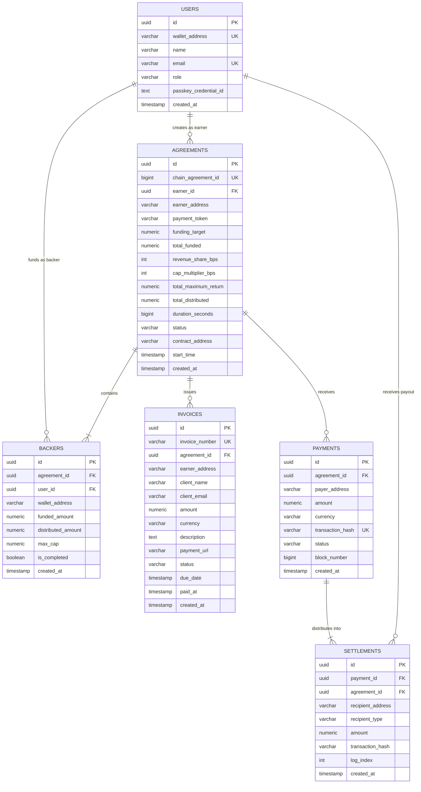

# BackFlow — Data Model & Schema Specification

## 1. Entity-Relationship Diagram (ERD)



---

## 2. On-Chain Solidity Data Structures

```solidity
enum AgreementStatus {
    DRAFT,
    FUNDING,
    ACTIVE,
    PAUSED,
    COMPLETED,
    EXPIRED,
    CANCELLED
}

struct Agreement {
    uint256 id;
    address earner;
    address paymentToken;
    uint256 fundingTarget;
    uint256 totalFunded;
    uint256 revenueShareBps;
    uint256 capMultiplierBps;
    uint256 totalMaximumReturn;
    uint256 totalDistributed;
    uint256 duration;
    uint256 startTime;
    AgreementStatus status;
}

struct BackerPosition {
    uint256 fundedAmount;
    uint256 distributedAmount;
    uint256 maxCap;
    bool isCompleted;
}
```

---

## 3. Storage Invariants & Precision Rules

1. **Monetary Units**:
   - Stored in atomic token decimals (`10^6` for USDC). Stored as `NUMERIC(38, 0)` in SQL to prevent any integer overflow or floating point truncation.
2. **Idempotency Compound Key**:
   - `UNIQUE (transaction_hash, log_index)` in `settlements`.
3. **Backer Uniqueness**:
   - `UNIQUE (agreement_id, wallet_address)` in `backers`.
