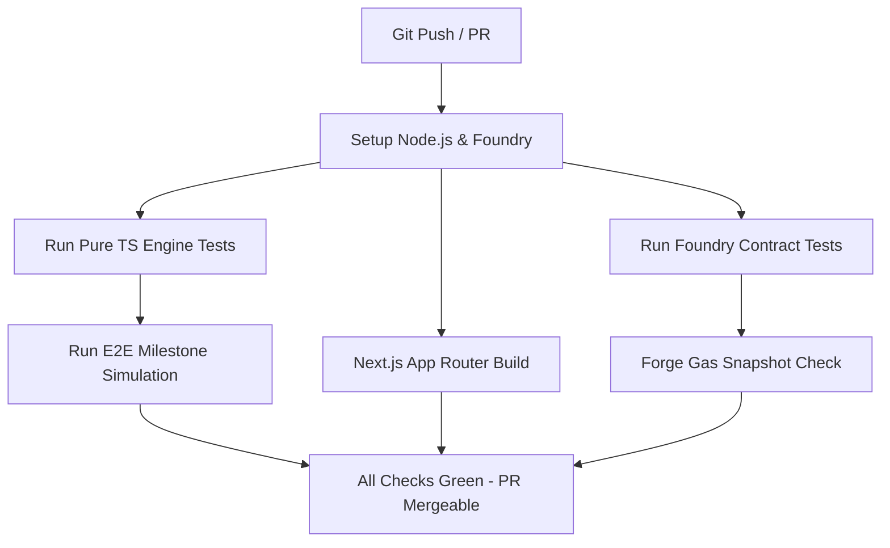

# BackFlow — GitHub Actions & CI/CD Pipeline Specification

## 1. CI/CD Architecture Overview

Every pull request and push to `main` must pass automated gates spanning smart contract invariants, financial math verification, static typing, and Next.js frontend builds.



---

## 2. Master CI Workflow (`.github/workflows/ci.yml`)

```yaml
name: BackFlow CI Pipeline

on:
  push:
    branches: [main, develop]
  pull_request:
    branches: [main]

concurrency:
  group: ${{ github.workflow }}-${{ github.ref }}
  cancel-in-progress: true

jobs:
  test-and-build:
    runs-on: ubuntu-latest
    steps:
      - name: Checkout Repository
        uses: actions/checkout@v4
        with:
          submodules: recursive

      - name: Install Foundry
        uses: foundry-rs/foundry-toolchain@v1
        with:
          version: nightly

      - name: Setup Node.js 20
        uses: actions/setup-node@v4
        with:
          node-version: 20
          cache: 'npm'

      - name: Install Monorepo Dependencies
        run: npm ci

      - name: Test Pure TypeScript Financial Engine
        run: npm run test:engine

      - name: Run Foundry Smart Contract Tests & Invariants
        run: |
          cd contracts
          forge test -vvv

      - name: Run Gas Profiling Snapshot
        run: |
          cd contracts
          forge snapshot --check

      - name: Run End-to-End Milestone Simulation
        run: npm run test:milestone

      - name: Build Next.js Web Application
        run: npx -w @backflow/web next build
```

---

## 3. Monad Testnet Deployment Workflow (`deploy-testnet.yml`)

```yaml
name: Deploy to Monad Testnet

on:
  workflow_dispatch:
    inputs:
      confirm:
        description: 'Type "DEPLOY" to confirm Monad testnet deployment'
        required: true

jobs:
  deploy:
    if: github.event.inputs.confirm == 'DEPLOY'
    runs-on: ubuntu-latest
    steps:
      - uses: actions/checkout@v4
        with:
          submodules: recursive

      - uses: foundry-rs/foundry-toolchain@v1

      - name: Broadcast Deployment Script
        env:
          DEPLOYER_PRIVATE_KEY: ${{ secrets.MONAD_DEPLOYER_PRIVATE_KEY }}
          MONAD_RPC_URL: ${{ secrets.MONAD_RPC_URL }}
        run: |
          cd contracts
          forge script script/Deploy.s.sol:DeployBackFlow \
            --rpc-url $MONAD_RPC_URL \
            --broadcast \
            -vvvv
```
