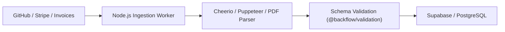

# BackFlow — Data Scraping & Verification Specification

## 1. Overview & Objectives

In BackFlow, data scraping and external document ingestion serve two key operational workflows:
1. **Earner Reputation & Social Proof Verification**: Ingesting public creator/developer metrics (GitHub commit activity, public portfolio metrics) to establish creditworthiness before syndicates fund an agreement.
2. **Invoice Verification & Ingestion**: Parsing structured client invoices and external payment receipts (e.g. Stripe invoice links, Upwork milestone receipts) to populate BackFlow payment links automatically.
3. **Block Explorer Fallback Scraper**: Querying explorer transaction pages as a resilient fallback if the RPC websocket drops logs.

---

## 2. Ingestion Pipeline & Architecture

---

## 3. Scraping & Ingestion Modules

### 3.1 Developer Reputation Scraper (GitHub)
- **Target**: Public GitHub user profiles (e.g. `https://github.com/[username]`).
- **Data Extracted**:
  - Total public contributions in past 12 months.
  - Active public repositories and star counts.
  - Account age.
- **Sanitization**: All HTML entities stripped; strict rate limiting (max 10 req/min per IP).

### 3.2 Invoice Metadata Ingestion (External Receipts)
- **Target**: Client invoice PDF / URL inputs provided by Earner.
- **Data Extracted**:
  - Client Name / Company.
  - Due Date.
  - Gross Invoice Amount ($ USD).
  - Scope of Work / Milestone Summary.
- **Output**: Generates a pre-filled BackFlow payment link (`/pay/[agreementId]?amount=[amount]&client=[clientName]`).

### 3.3 Explorer Fallback Scraper
- **Target**: `https://testnet.monadexplorer.com/tx/[txHash]`
- **Usage**: Invoked only when `viem.getTransactionReceipt()` returns null after 30 seconds.
- **Extraction**: Status (Success/Failure), Block Number, Gas Used.
