# BackFlow — Complete End-to-End Workflow Flow Diagram

> **Architecture Standard**: On-chain single source of truth settlement protocol  
> **Target Rail**: Monad Testnet (EVM)  
> **Workflow Pattern**: `User/Input` $\rightarrow$ `Data Collection` $\rightarrow$ `Processing` $\rightarrow$ `Core Logic/Execution Engine` $\rightarrow$ `Decision Making` $\rightarrow$ `Action/Execution` $\rightarrow$ `Output` $\rightarrow$ `Feedback/Storage`  

---

## 1. Master End-to-End Visual Workflow Diagram

```mermaid
flowchart TD
    %% STAGE 1: USER / INPUT
    subgraph STAGE1 ["1. User / Input"]
        U1["Earner: Defines Funding Target, Rev Share %, Cap Multiplier"]
        U2["Backer Syndicate: Deposits Upfront Capital"]
        U3["Client / Payer: Opens Payment Link (backflow.app/pay/BF-001)"]
        U4["Client: Authorizes 1-Click Payment via Biometric Passkey"]
    end

    %% STAGE 2: DATA COLLECTION
    subgraph STAGE2 ["2. Data Collection"]
        DC1["Web App: Parses Agreement ID, Invoice Terms & Payer Address"]
        DC2["Validation Layer: Validates BPS (100-10000), Target (>0), Token Address"]
        DC3["Passkey / WebAuthn Client: Signs EIP-712 UserOp / Payment Intent"]
    end

    %% STAGE 3: PROCESSING
    subgraph STAGE3 ["3. Processing"]
        P1["Payment Adapter: Packages Payment Intent Session"]
        P2["BackFlow Relayer: Verifies Signature & Sponsors Gas (Paymaster)"]
        P3["EVM RPC Gateway: Broadcasts Transaction to Monad Testnet"]
    end

    %% STAGE 4: CORE LOGIC / ENGINE
    subgraph STAGE4 ["4. Core Logic / Settlement Engine (On-Chain)"]
        CL1["SettlementEngine.sol: Receives Gross Payment via safeTransferFrom"]
        CL2["State Reader: Queries AgreementManager.sol for Active Status & Terms"]
        CL3["BPS Arithmetic Engine: Calculates Raw Backer Pool Cut = (Gross * revShareBps) / 10000"]
    end

    %% STAGE 5: DECISION MAKING
    subgraph STAGE5 ["5. Decision Making & Cap Clamping"]
        DM1{"Is Agreement ACTIVE & Unexpired?"}
        DM2{"For each Backer: Is Distributed < MaxCap?"}
        DM3["Calculate Pro-Rata Share = (RawCut * FundedAmount) / TotalFunded"]
        DM4["Clamp Payout = min(ProRataShare, RemainingCap)"]
        DM5{"Did any Backer reach Cap?"}
        DM6["Cascade Excess Unallocated Share directly to Earner"]
        DM7{"Are ALL Backers at MaxCap?"}
    end

    %% STAGE 6: ACTION / EXECUTION
    subgraph STAGE6 ["6. Action / Execution (Atomic On-Chain Settlement)"]
        EX1["Update On-Chain Accounting: recordSettlementDistribution() (CEI)"]
        EX2["ERC-20 Transfer: safeTransfer() Pro-Rata Cuts to Backer Wallets"]
        EX3["ERC-20 Transfer: safeTransfer() Net Revenue (P_gross - sum(BackerPayouts)) to Earner"]
        EX4["State Transition: markAgreementCompleted() if all caps satisfied"]
        EX5["Event Emission: Emit PaymentSettled & BackerPaid Logs"]
    end

    %% STAGE 7: OUTPUT
    subgraph STAGE7 ["7. Output"]
        OUT1["Payer: Receives Verified Monad Tx Hash & Digital Receipt"]
        OUT2["Earner: Instant Wallet Balance Increase (90% Net Revenue)"]
        OUT3["Backers: Instant Wallet Balance Increase (Pro-rata Shares)"]
        OUT4["Protocol Invariant Check: Delta Balance = 0 (Zero Trapped Funds)"]
    end

    %% STAGE 8: FEEDBACK / STORAGE
    subgraph STAGE8 ["8. Feedback / Storage & Indexing"]
        FB1["Viem Blockchain Listener: Subscribes to Contract Event Stream"]
        FB2["Idempotency Filter: Validates unique (transaction_hash, log_index)"]
        FB3["PostgreSQL / Supabase: Updates agreements, payments & settlements Tables"]
        FB4["Earner & Backer Dashboards: Live WebSocket Push / Cache Invalidation"]
    end

    %% CONNECTIONS ACROSS STAGES
    U1 & U2 & U3 & U4 --> STAGE2
    STAGE2 --> STAGE3
    STAGE3 --> STAGE4
    STAGE4 --> DM1
    DM1 -- "Yes" --> DM2
    DM1 -- "No" --> REVERT["Transaction Reverts (CEI Safe)"]
    DM2 -- "Yes" --> DM3 --> DM4
    DM2 -- "No (Cap Met)" --> DM6
    DM4 --> DM5
    DM5 -- "Cap Reached" --> DM6
    DM6 --> DM7
    DM7 --> STAGE6
    STAGE6 --> STAGE7
    STAGE7 -.-> STAGE8
```



---

## 2. Detailed Stage-by-Stage Workflow Breakdown

### Stage 1: User / Input
* **Earner Onboarding**:
  * The earner (e.g. Rahul, freelance developer) accesses `/dashboard` and creates a revenue-sharing agreement.
  * Inputs: Funding Target (`$2,000 USDC`), Revenue Share (`10.00%` / `1,000 BPS`), Return Cap Multiplier (`2.0×` / `20,000 BPS`), Duration (`365 Days`).
* **Backer Syndicate Funding**:
  * Backers deposit capital upfront into `AgreementManager.sol` during the `FUNDING` state.
  * Once the `$2,000` target is reached, the agreement automatically activates and the upfront `$2,000` is immediately transferred to the earner's wallet.
* **Client / Payer Checkout**:
  * The client opens the payment link: `backflow.app/pay/BF-001`.
  * The client triggers payment via Touch ID / Face ID passkey or standard Web3 wallet.

---

### Stage 2: Data Collection
* **Input Extraction**: The client application extracts `agreementId`, `amount` (`$1,000.00 USDC`), `invoiceId`, and `payerAddress`.
* **Validation Layer (`@backflow/validation`)**:
  * Validates Basis Points: $0 < \text{revenueShareBps} \le 10,000$.
  * Validates Cap Multiplier: $\text{capMultiplierBps} \ge 10,000$ ($1.0\times$).
  * Validates Address format: Verified 42-character checksummed EVM address.
* **Biometric Authentication**: Client signs the payment intent or permit with WebAuthn (Passkey) or native EVM signature.

---

### Stage 3: Processing
* **Session Initialization**: `TestnetPaymentAdapter` generates a secure payment session ID.
* **Gas Sponsorship (Paymaster / Relayer)**:
  * For consumer-grade gasless UX, the BackFlow Relayer intercepts the signed intent.
  * The relayer sponsors network gas using `RELAYER_PRIVATE_KEY` on Monad testnet so the client never needs testnet MON.
* **EVM Broadcast**: Viem client encodes the ABI payload for `settlePayment(agreementId, 1000000000, payer)` and broadcasts it to the Monad RPC node.

---

### Stage 4: Core Logic / Execution Engine
* **Contract Entry**: `SettlementEngine.sol` receives the transaction call.
* **Token Pull**: Executes `SafeERC20.safeTransferFrom(paymentToken, payer, address(this), 1000 * 10^6)` pulling `$1,000 USDC` into the settlement router.
* **State Interrogation**:
  * Queries `AgreementManager.sol` for agreement metadata, verifying status is strictly `AgreementStatus.ACTIVE`.
  * Verifies agreement expiration: `block.timestamp <= startTime + duration`.
* **Raw Revenue Share Cut**:
  $$\text{rawBackerCut} = \frac{\text{grossAmount} \times \text{revenueShareBps}}{10,000} = \frac{\$1,000 \times 1,000}{10,000} = \$100.00 \text{ USDC}$$

---

### Stage 5: Decision Making & Cap Clamping
* **Syndicate Iteration**:
  The contract loops through the registered backer syndicate (e.g. Aman, Priya, Karan).
* **Pro-Rata Formula**:
  $$\text{Theoretical Entitlement}_i = \frac{\text{rawBackerCut} \times \text{fundedAmount}_i}{\text{totalFunded}}$$
* **Cap Enforcement Logic**:
  $$\text{Remaining Cap}_i = \max(0, \text{maxCap}_i - \text{distributedAmount}_i)$$
  $$\text{Actual Payout}_i = \min(\text{Theoretical Entitlement}_i, \text{Remaining Cap}_i)$$
* **Automatic Cascading**:
  If any backer hits their cap, unallocated portion automatically falls back to the earner.
* **Completion Decision**:
  If all backers have received $\ge \text{maxCap}$, the contract triggers `markAgreementCompleted(agreementId)`.

---

### Stage 6: Action / Execution (Atomic On-Chain Settlement)
* **Checks-Effects-Interactions (CEI)**:
  Internal accounting updated *before* any external token transfer:
  `agreementManager.recordSettlementDistribution(agreementId, backerAddress, payout)`.
* **Backer Token Transfers**:
  * Backer A (20% share): `safeTransfer(backerA, $20.00 USDC)`
  * Backer B (30% share): `safeTransfer(backerB, $30.00 USDC)`
  * Backer C (50% share): `safeTransfer(backerC, $50.00 USDC)`
* **Earner Waterfall Payout**:
  $$\text{Earner Payout} = \text{Gross Payment} - \sum \text{Backer Payouts} = \$1,000 - \$100 = \$900.00 \text{ USDC}$$
  Executes `safeTransfer(earner, $900.00 USDC)`.
* **Zero Trapped Funds Invariant Check**:
  $$\Delta \text{Balance}(\text{SettlementEngine}) = \$1,000 - (\$100 + \$900) = 0$$
* **Event Logging**:
  Emits `PaymentSettled(agreementId, payer, 1000000000, 100000000, 900000000)` and `BackerPaid` for each backer.

---

### Stage 7: Output
* **Client / Payer**:
  * Immediate visual confirmation on `/pay/[id]` with Monad block transaction hash.
  * Downloadable / shareable payment receipt.
* **Earner**:
  * Earner wallet balance increments by `$900.00 USDC`.
* **Backers**:
  * Backer wallets immediately increment by their respective pro-rata distributions.

---

### Stage 8: Feedback / Storage & Indexing
* **Event Subscription**: Node.js `BlockchainListener` catches on-chain `PaymentSettled` event.
* **Idempotency Guarantee**:
  * Generates key: `${transactionHash}:${logIndex}`.
  * Ignores duplicates if replay occurs.
* **Database Mirror Update**:
  * Inserts record into `payments` and `settlements` tables in PostgreSQL / Supabase.
  * Updates `total_distributed` and status in `agreements` and `backers` tables.
* **Real-Time UI Reflection**:
  * Earner Dashboard (`/dashboard`) updates metrics cards and revenue bars.
  * Backer Portfolio view updates cumulative ROI and remaining cap meters.

---

## 3. Canonical Test Case Trace (Rahul $2,000 / $1,000 Payment)

```
[INPUT] Client pays $1,000 USDC on Monad Testnet
   │
   ├── [ENGINE] SettlementEngine receives $1,000 USDC
   │
   ├── [CALCULATION] 10% Revenue Share Cut = $100.00 USDC
   │
   ├── [DISTRIBUTION]
   │    ├── Backer A (20% pool): receives $20.00 USDC (Cap Remaining: $780)
   │    ├── Backer B (30% pool): receives $30.00 USDC (Cap Remaining: $1,170)
   │    ├── Backer C (50% pool): receives $50.00 USDC (Cap Remaining: $1,950)
   │    └── Rahul (Earner):      receives $900.00 USDC (90% net revenue)
   │
   └── [STORAGE] Indexer records settlement; zero trapped tokens in contract!
```
