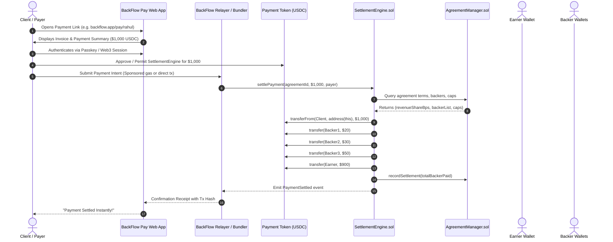

# BackFlow Payment Flow & Integration Architecture

## 1. End-to-End Consumer Payment Flow



---

## 2. Payment Adapter Abstraction

To ensure BackFlow easily integrates future fiat on-ramps (Stripe, MoonPay) without touching smart contract settlement logic, we introduce a polymorphic payment adapter:

```typescript
export interface PaymentIntent {
  agreementId: string;
  invoiceId?: string;
  payerAddress: string;
  amount: bigint;
  currency: string;
  metadata?: Record<string, any>;
}

export interface PaymentSettlementResult {
  transactionHash: string;
  blockNumber: number;
  grossAmount: bigint;
  backerShareTotal: bigint;
  earnerShare: bigint;
  backerDistributions: {
    backerAddress: string;
    amount: bigint;
    capReached: boolean;
  }[];
}

export interface IPaymentAdapter {
  name: string;
  createPaymentIntent(intent: PaymentIntent): Promise<{ paymentUrl: string; paymentId: string }>;
  settle(intent: PaymentIntent, signerOrRelayer: any): Promise<PaymentSettlementResult>;
}
```

---

## 3. Direct Distribution vs Claim-Based Settlements

- **Current Prototype (Direct Distribution)**:
  - For syndicates up to 20-50 backers, executing direct batch token transfers in `settlePayment()` provides an extraordinary user experience.
  - Backers immediately see funds arrive in their wallets with zero claiming friction.
- **Future Scale Path (Accounting + Merkle / Claim)**:
  - When backer pools scale to thousands, `SettlementEngine` transitions to virtual balance accounting (`claimableBalance[backer] += share`), allowing backers to batch claim when gas-optimal.
